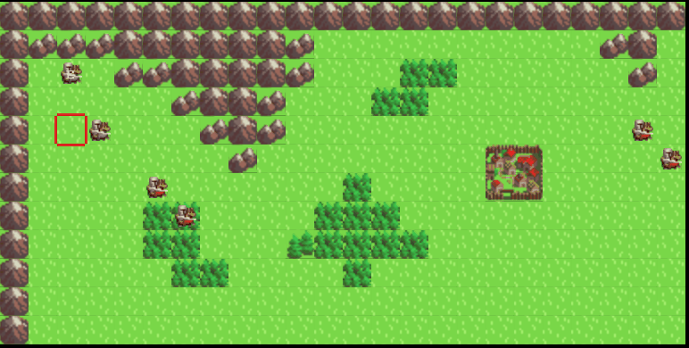

## What is this game

Medieval War is a turn-based strategy game I created in my free time for education purposes, inspired by Fire Emblem series. This game is built in JavaScript using the Phaser 3 Framework.

## Components
The game can be broken down into components list as below.
1. Core gameplay
    1. Map
        1. Map data and loading - still need some code refactoring, especially with *level* class
        2. Cursor - Done for now
        3. Control
            * Interaction (Select, Cancel etc)
            * Movement - Done
        4. Context menu
            * List action - Done
            * Interaction
        5. Camera
    2. Unit
        1. Initialize units - Done
        2. Turn system - Done, need refactoring
        3. Movement
            * Movable location - Need more testing and code refactoring
            * Path finding - Need more testing and code refactoring
            * Actions - In progress
    3. Attack enemy unit - In progress
        * Detect enemy unit - Done
        * Select the unit to attack by moving cursor - Done
        * Show damage, hit rate etc calculation
        * If user choose to attack, update unit status after attack (HP etc) - Done
    4. Ally Support - Not implemented
    5. Battle system - In progress
        1. Hit - evasion calculation
        2. Damage calculation - In progress
        3. Support calculation
    6. AI
        1. Detect player unit in range, then move next to them - Done
        2. Aggressiveness level
        3. Decision making (to attack or not etc)
    7. Map objectives - Not implemented
2. Character
    1. Classes - Created base class and a few classes
    2. Character data - Not implemented
    3. Character sprite - animation  - No animation for now
    4. Leveling system - Not implemented
3. Items - Not implemented
    1. Unit inventory
    2. Unit equipment
    3. Trade
    4. Shop

## Assets

### Graphics
* [https://opengameart.org/content/toens-medieval-strategy-sprite-pack-v10-16x16](https://opengameart.org/content/toens-medieval-strategy-sprite-pack-v10-16x16) by Toen (CC-BY 3.0)

## License

This project is under MIT License.